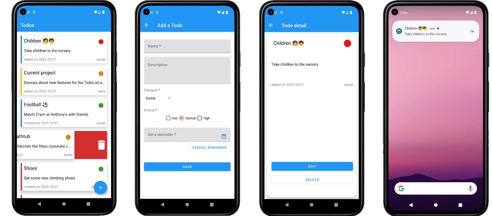

# Todos 📋
**Todos** is a sample todolist Android application 📱 built to demonstrate use of *Modern Android development* tools.



## About ⁉️
You can easily create, update, delete, restore after deletion Todos. You also have the possibility to set an extended description and define priority, category and notification reminders for your Todos.

## Download ⬇️
- Download latest release [here](https://github.com/Florian-Martin/todos-list/releases/download/v1.0.0/todos.apk)

## Built with 🛠
- [Kotlin](https://kotlinlang.org/) - First class and official programming language for Android development.
- [Coroutines](https://kotlinlang.org/docs/reference/coroutines-overview.html) - For asynchronous and more..
- [Flow](https://kotlin.github.io/kotlinx.coroutines/kotlinx-coroutines-core/kotlinx.coroutines.flow/-flow/) - A cold asynchronous data stream that sequentially emits values and completes normally or with an exception.
- [Android Architecture Components](https://developer.android.com/topic/libraries/architecture) - Collection of libraries that help you design robust, testable, and maintainable apps.
  - [LiveData](https://developer.android.com/topic/libraries/architecture/livedata) - Data objects that notify views when the underlying database changes.
  - [ViewModel](https://developer.android.com/topic/libraries/architecture/viewmodel) - Stores UI-related data that isn't destroyed on UI changes. 
  - [ViewBinding](https://developer.android.com/topic/libraries/view-binding) - Generates a binding class for each XML layout file present in that module and allows you to more easily write code that interacts with views.
  - [Room](https://developer.android.com/topic/libraries/architecture/room) - SQLite object mapping library.
  - [RecyclerView + ListAdapter](https://developer.android.com/reference/androidx/recyclerview/widget/ListAdapter) - Presenting List data in a RecyclerView, including computing diffs between Lists on a background thread 
- [Safe Args](https://developer.android.com/guide/navigation/navigation-pass-data) - To pass data through destinations
- [WorkManager](https://developer.android.com/topic/libraries/architecture/workmanager) - The recommended solution for scheduled through app restarts and system reboots work.
- [Notifications](https://developer.android.com/develop/ui/views/notifications) - To provide user with reminders
- [Unit tests](https://developer.android.com/training/testing/local-tests)
- [Instrumented tests](https://developer.android.com/training/testing/instrumented-tests)
- [Navigation tests](https://developer.android.com/guide/navigation/navigation-testing) 

## Structure 📂
```
.
├── adapter
│   ├── TodoAdapter
├── data
│   ├── TodoCategoryDao.kt
│   ├── TodoDao.kt
│   ├── TodoDatabase.kt
├── gesture
│   ├── SwipeToDeleteCallback.kt
├── model
│   ├── Todo.kt
│   ├── TodoAndCategory.kt
│   ├── TodoCategory.kt
├── ui
│   ├── AddOrEditFragment.kt
│   ├── DatePickerFragment.kt
│   ├── MainActivity.kt
│   ├── TimePickerFragment.kt
│   ├── TodoDetailFragment.kt
│   ├── TodosListFragment.kt
├── utils
│   ├── Utils.kt
│   ├── WorkerUtils.kt
├── viewmodel
│   ├── TodoViewModel.kt
├── worker
│   ├── TodoReminderNotificationWorker.kt
│   Constants.kt
│   TodoApplication.kt
```